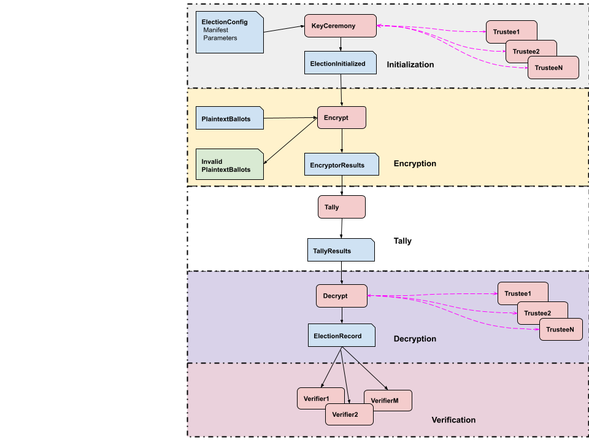

# Election System Certification
draft 4/14/2022



All the software components in the diagram are [reproducible builds](https://reproducible-builds.org/)

The source must be publicly available (maybe not necessarily open source?)

There is an impartial broker, probably a national agency or non-partisan consortium.

### Testing

Broker provides test inputs and expected outputs.

Anyone can provide tests. Broker certifies results.

All tests are public and downloadable.

Iterate until correct behavior is clear.

Broker arbitrates disputes.

#### Initialization

Broker provides ElectionConfig, Trustees, expected ElectionInitialized.

#### Encryption

Broker provides ElectionInitialized, PlaintextBallots, expected EncryptorResults.

#### Tally

Broker provides EncryptorResults, expected TallyResults.

#### Decryption

Broker provides TallyResults, Trustees, expected ElectionRecord.

#### Verification

Broker provides ElectionRecord, expected VerificationResults.

### Supplier Software Certification

Supplier provides reproducible build of their component(s). 

Broker tests components, and certifies if they pass.

Trustees are tested against all certified systems.

Components are tested against all other certified components.

Certified components are built and signed by the Broker. Development is frozen ? months before use in an election.

Anyone can reproduce the build and report problems.

Older software can be decertified if it no longer passes testing.

### Stake holders

Partisan groups are encouraged to participate in testing and certification.

Academic and commercial organizations are encouraged to find vulnerabilites and show how to exploit them.

### vendors

Vendors participate in providing test cases. 

Vendors must only use signed, certified software, downloaded from the broker, for elections. (How to ensure this?)


### Elections

Anyone can challenge results, following impartial rules.

The broker can adjudicate election results, and validation results.


## Problems

How to verify that the PlaintextBallot accurately reflects the physical ballot? Audits?

How to verify election system is running verified software?

Governance for the broker. How to prevent it from being hijacked or sclerotic?

## Why?

````
    Emerson visited Thoreau in jail and asked “Henry, why are you here?” 
    Thoreau purportedly responded: “Waldo, why are you not here?”
````