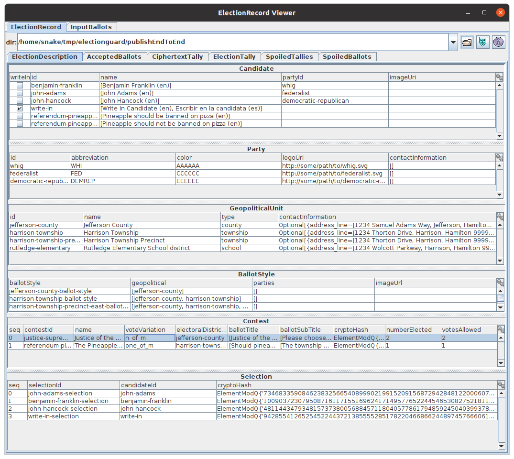

# 🗳 ElectionGuard Java 

## Visualization

The _com.sunya.electionguard.viz.ElectionGuardViewer_ is a Swing-based visualizer of Election Records
for developers.

````
Usage: java -classpath electionguard-java-all.jar 
      com.sunya.electionguard.viz.ElectionGuardViewer
````



### Notes

This will migrate to a seperate module or project later.